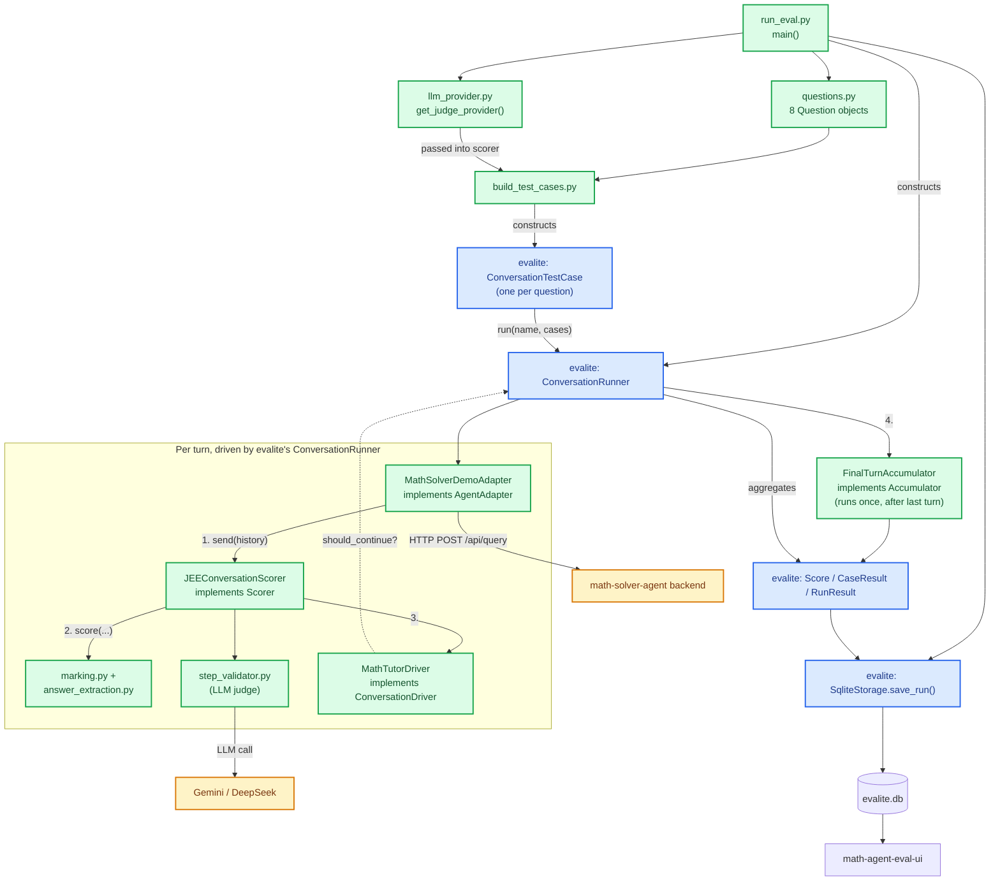

# math-agent-eval flow

Color-coded by where evalite is actually doing the work: **blue = evalite
framework code (imported)**, **green = custom `math_eval` code (implements
evalite's Protocols)**, **amber = external services**.

## Where evalite is actually doing the work (blue boxes)

- **`ConversationTestCase`** — the unit `build_test_cases.py` constructs, one
  per question, carrying our custom scorer/driver/accumulator as attached
  objects.
- **`ConversationRunner`** — the actual execution engine: it owns the turn
  loop shown in the `TurnLoop` box (calls `adapter.send()`, `scorer.score()`,
  then `driver.should_continue()`/`next_message()` in sequence each turn),
  applies the accumulator on the last turn, and bounds concurrency across
  all 24 conversations (8 questions × 3 iterations).
- **`Score`/`CaseResult`/`RunResult`** — evalite's result models, produced
  by the runner regardless of what scorer/driver you plug in.
- **`SqliteStorage.save_run()`** — evalite's persistence layer, called
  explicitly from `run_eval.py` since `ConversationRunner` (unlike
  `Runner`) doesn't take storage in its constructor.

Every green box in `TurnLoop` labeled "implements X" satisfies one of
evalite's four Protocols (`AgentAdapter`, `Scorer`, `ConversationDriver`,
`Accumulator`) structurally — no inheritance, just matching method
signatures. Everything green is ours: the JEE-specific marking logic, the
LLM step judge, the non-revealing retry driver, and the HTTP adapter —
evalite has no idea any of that is math, JEE, or Gemini-specific; it just
drives whatever satisfies its Protocols.
